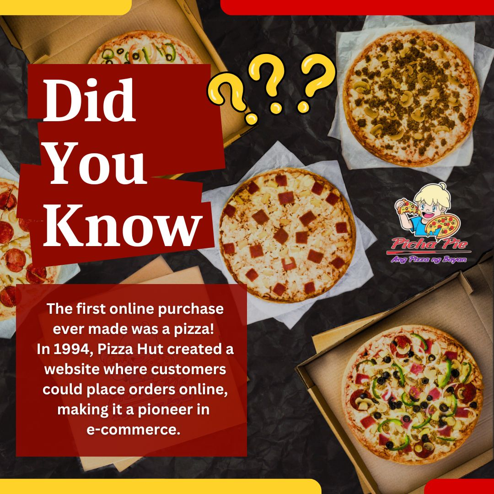
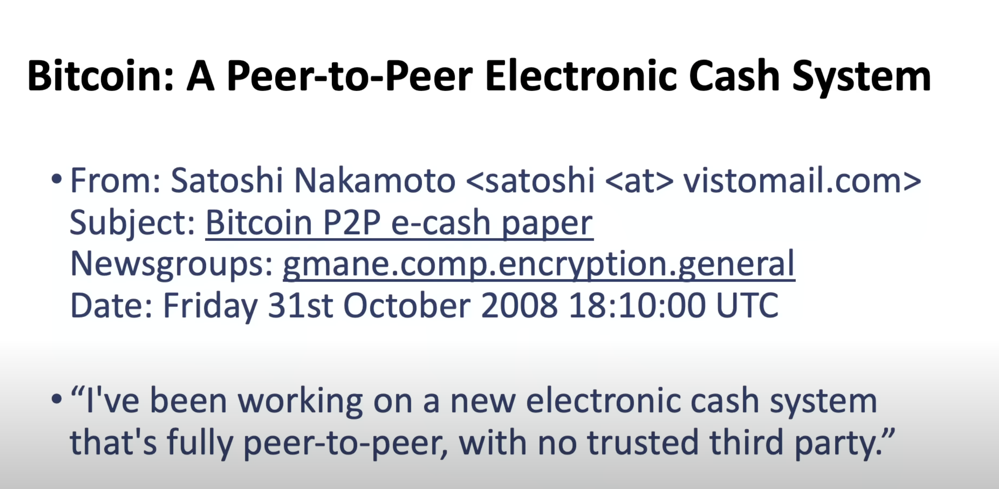
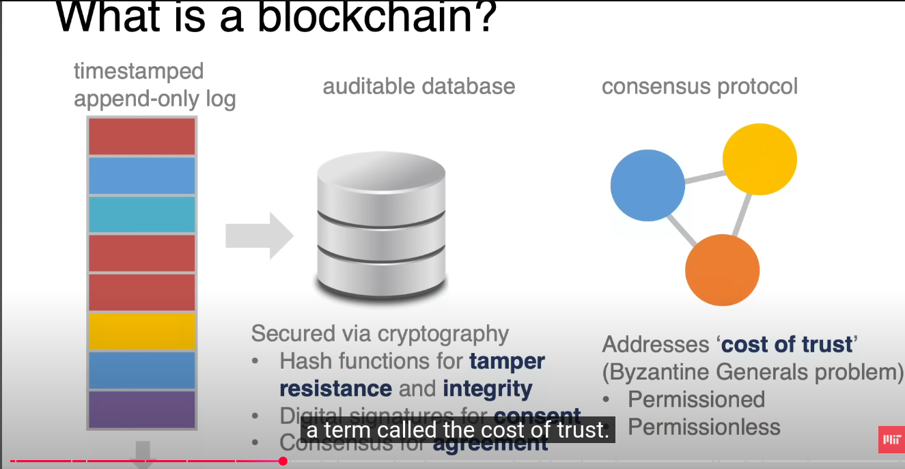
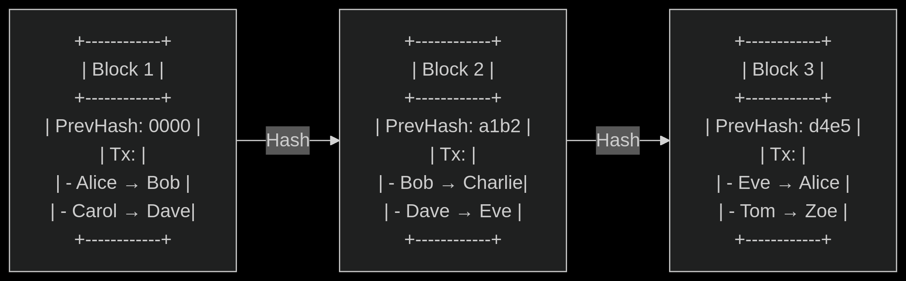
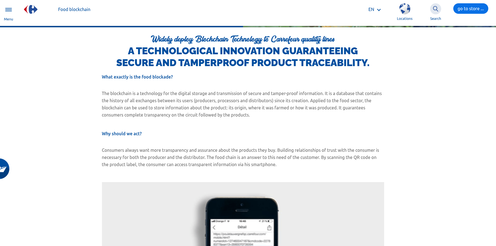
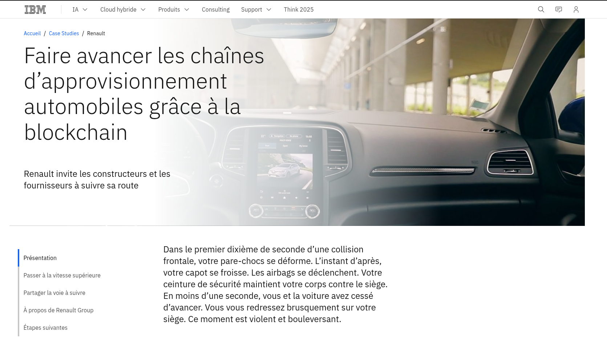

# Introduction to Blockchain

#### Understanding the Technology and Its Real-World Impact

---

# Internet Protocol Layers

The internet: Layers of open protocols

1. **Link Layer** – Ethernet (physical/data link connectivity) 1974

---

# Internet Protocol Layers

The internet: Layers of open protocols

1. **Link Layer** – Ethernet (physical/data link connectivity) 1974
2. **Network Layer** – TCP/IP (connectivity) 1974

---

# Internet Protocol Layers

The internet: Layers of open protocols

1. **Link Layer** – Ethernet (physical/data link connectivity) 1974
2. **Network Layer** – TCP/IP (connectivity) 1974
3. **Application Layer** – HTTP 1990

---

# PIZZA Hut: 1994 (First Online Sale) PizzaNet

---

# Internet Protocol Layers

The internet: Layers of open protocols

1. **Link Layer** – Ethernet (physical/data link connectivity) 1974
2. **Network Layer** – TCP/IP (connectivity) 1974
3. **Application Layer** – HTTP 1990  
  PIZZA Hut: 1994 (first sale) pizza.net
4. **Application Layer** – SSL/TLS 1996

---

# Internet Protocol Layers

The internet: Layers of open protocols

1. **Link Layer** – Ethernet (physical/data link connectivity) 1974
2. **Network Layer** – TCP/IP (connectivity) 1974
3. **Application Layer** – HTTP 1990  
  PIZZA Hut: 1994 (first sale) pizza.net
4. **Application Layer** – SSL/TLS 1996
5. **Bitcoin?**

---

# First Purchase Made with Bitcoins

---

# Failed P2P Systems (Before Bitcoin)

| Name                | Year | Description                    | Reason for Failure                |
|---------------------|------|--------------------------------|-----------------------------------|
| **e-gold**          | 1996 | Gold-backed digital currency   | Shut down (2009): legal issues    |
| **Liberty Reserve** | 2006 | Anonymous USD/EUR transfers    | Shut down (2013): money laundering|
| **DigiCash**        | 1989 | Privacy-focused digital cash   | Bankrupt (1998): no traction      |
| **GoldMoney (P2P)** | 2001 | Gold as digital money          | P2P disabled due to regulation    |

---

## Successful Systems (Before Bitcoin)

| Name         | Year | Description                      | Status                      |
|--------------|------|----------------------------------|-----------------------------|
| **PayPal**   | 1998 | P2P transfers via email/PDA      | Still active, global leader |
| **Alipay**   | 2004 | P2P + e-commerce payment         | Dominant in China           |
| **WebMoney** | 1998 | Russian P2P and digital wallet   | Still active                |
| **M-Pesa**   | 2007 | Mobile money via SMS             | Huge success in Africa      |

---

## Lessons Learned

- Most early systems failed due to **centralization** and **regulatory pressure**
- **Success** came to those who:
  - Solved real problems
  - Embraced regulation (or operated in regulatory gaps)
- **Bitcoin (2009)** was the first **truly decentralized** P2P system

---

# Cryptography?

---

# Cryptography

## Communications in the Presence of Adversaries

## SSL/TLS

---

# A Brief History of Blockchain

🧾 **Before Bitcoin:**
- **1980s**: David Chaum created **eCash** – a cryptographic digital money
- Early ideas of privacy, decentralization, and digital signatures
- Used by banks but never achieved global adoption

**2008:** Satoshi Nakamoto published the Bitcoin whitepaper  
*"Bitcoin: A Peer-to-Peer Electronic Cash System"*

**Why?**
- Reaction to the **2008 financial crisis**
- Wanted a system without banks or central control
- Solved the **double-spending problem** with blockchain + proof-of-work

⚙️ Bitcoin = eCash + blockchain innovation

---

---

# What is a Blockchain?
| ** Timestamped Append-Only Log** | ** Consensus Protocol** |
|------------------------------------|--------------------------|
| - Sequential, time-stamped data    - Immutable (append-only) | - Solves **Byzantine Generals Problem**   - Reduces **“cost of trust”**   - Networks: Permissioned / Permissionless |
| **Auditable Database (Cryptography)** |  |
| - Hash functions → **tamper resistance**, **integrity**   - Digital signatures → **consent**   - Consensus → **agreement** |  |

---

---

# Components of a Blockchain

1. **Blocks** – store data and metadata (hash, timestamp)
2. **Nodes** – participants in the network
3. **Consensus Mechanisms** – agree on valid transactions (PoW, PoS)
4. **Smart Contracts** – self-executing code on-chain

🔐 Cryptography and decentralization ensure trust and security.

---

# Block Structure

---

# Consensus

## Proof of work (PoW)
A piece of data (the proof) that requires significant computation to
find. In Ethereum, miners must find a numeric solution to the Ethash
algorithm that meets a network-wide difficulty target.

## Proof of stake (PoS)
A method by which a cryptocurrency blockchain protocol aims to
achieve distributed consensus. PoS asks users to prove ownership of a
certain amount of cryptocurrency (their “stake” in the network) in
order to be able to participate in the validation of transactions.

---

# Nodes

---

# 🔁 Blockchain Generations

1️⃣ **1st Gen** – Bitcoin (digital currency)  
2️⃣ **2nd Gen** – Ethereum (smart contracts, Layer2, ZK)  
3️⃣ **3rd Gen** – Solana, Polkadot, etc. (scalability, interoperability)

🧱 Each generation solves the limitations of the previous one.

---

# 💻 Smart Contracts (Code is Law)

- **What are they?** Programs that run on the blockchain
- Written in **Solidity (EVM)** or **Rust (Solana, Near)**
- Deployed and executed by transactions

🔧 Examples:
- ERC20 token contract
- NFT minting
- Decentralized voting
- Escrow system

---

# 🔍 Real Use Cases

✅ **Cryptocurrencies** – Decentralized digital money (e.g., Bitcoin, Ethereum)  
✅ **Supply Chain** – Transparent, tamper-proof tracking of goods  
✅ **Identity Management** – Secure digital IDs (e.g., passports, credentials)  
✅ **Healthcare** – Immutable patient records & drug traceability

---

---

---

# Digital Identity (In Group)

Verifiable credentials

---

# Some Sources

- Build your own ethereum blockchain: [https://github.com/dawar2151/ethereum-docker/tree/master](https://github.com/dawar2151/ethereum-docker/tree/master)
- Bitcoin whitepaper: [https://bitcoin.org/bitcoin.pdf](https://bitcoin.org/bitcoin.pdf)
- Gavin Wood(mastering-ethereum): [https://wiki.anomalous.xyz/pdfs/mastering-ethereum.pdf](https://wiki.anomalous.xyz/pdfs/mastering-ethereum.pdf)
