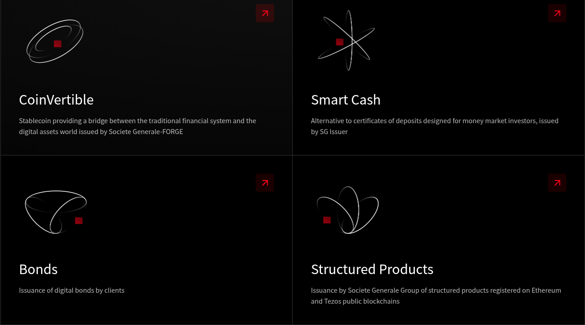

# Introduction to the Blockchain

#### Understanding the Technology and Its Real-World Impact

---

# About Me (@ettaousy)

- **Blockchain Engineer** (TradFi ↔ DeFi), 2022–Present
- **Blockchain Engineer Thales, Lead Tech, IN GROUP**, 2019–2022
- **Reasearhc lab**
- **Intern, Maxeware Technology**, 2014

**Education:**  
- M1/M2 Computer Science, Aix-Marseille (2017–2019)  
- Bachelor's in Software Quality, Mohammed V University, Rabat (2013–2014)  
- BTS DSI, Kenitra (2010–2012)
<!-- 
Course Introduction: Why Blockchain?
To understand the importance of blockchain, we need to go back to the period after World War II. After the war, the Allied nations came together to rebuild the global financial system. This led to the Bretton Woods Agreement in 1944, where it was decided that:

The US dollar would become the world's reserve currency.

It would be backed by gold, meaning every dollar could be exchanged for a fixed amount of gold.

Other national currencies were pegged to the US dollar at fixed exchange rates.

This system brought stability for a few decades, but in 1971, US President Richard Nixon unilaterally ended the gold standard — meaning the dollar was no longer backed by gold. This move effectively made all currencies fiat (not backed by any physical asset), and it shook the global financial system.

In the years that followed, concerns about centralized monetary control, inflation, and financial surveillance grew. Some libertarians and technologists tried to create alternative forms of digital money, like e-gold, but these early attempts were centralized and ultimately shut down by governments.

Then, in 2009, a revolutionary idea was born: Bitcoin. It introduced the concept of decentralized digital money — a currency not controlled by any government or corporation, and built on a transparent, secure technology: the blockchain. -->

---
|  |  |
|:---------------------------------------------:|:------------------------------------------------------------:|
| **Bretton Woods Agreement, 1944**             | **Nixon Ends Gold Standard, 1971**                           |
---
# Inflation

---
# Internet Protocol Layers

The internet: Layers of open protocols

1. **Link Layer** – Ethernet (physical/data link connectivity) 1974

---

# Internet Protocol Layers

The internet: Layers of open protocols

1. **Link Layer** – Ethernet (physical/data link connectivity) 1974
2. **Network Layer** – TCP/IP (connectivity) 1974

---

# Internet Protocol Layers

The internet: Layers of open protocols

1. **Link Layer** – Ethernet (physical/data link connectivity) 1974
2. **Network Layer** – TCP/IP (connectivity) 1974
3. **Application Layer** – HTTP 1990

---

# PIZZA Hut: 1994 (First Online Sale) PizzaNet

  
  <strong>First Online Sale:</strong> Pizza Hut, 1994 (PizzaNet)

---

# Internet Protocol Layers

The internet: Layers of open protocols

1. **Link Layer** – Ethernet (physical/data link connectivity) 1974
2. **Network Layer** – TCP/IP (connectivity) 1974
3. **Application Layer** – HTTP 1990  
  PIZZA Hut: 1994 (first sale) pizza.net
4. **Application Layer** – SSL/TLS 1996

---

# Internet Protocol Layers

The internet: Layers of open protocols

1. **Link Layer** – Ethernet (physical/data link connectivity) 1974
2. **Network Layer** – TCP/IP (connectivity) 1974
3. **Application Layer** – HTTP 1990  
  PIZZA Hut: 1994 (first sale) pizza.net
4. **Application Layer** – SSL/TLS 1996
5. **Bitcoin?**

---

# First Purchase Made with Bitcoins

---

# Failed P2P Systems (Before Bitcoin)

| Name                | Year | Description                    | Reason for Failure                |
|---------------------|------|--------------------------------|-----------------------------------|
| **e-gold**          | 1996 | Gold-backed digital currency   | Shut down (2009): legal issues    |
| **Liberty Reserve** | 2006 | Anonymous USD/EUR transfers    | Shut down (2013): money laundering|
| **DigiCash**        | 1989 | Privacy-focused digital cash   | Bankrupt (1998): no traction      |
| **GoldMoney (P2P)** | 2001 | Gold as digital money          | P2P disabled due to regulation    |

---

## Successful Systems (Before Bitcoin)

| Name         | Year | Description                      | Status                      |
|--------------|------|----------------------------------|-----------------------------|
| **PayPal**   | 1998 | P2P transfers via email/PDA      | Still active, global leader |
| **Alipay**   | 2004 | P2P + e-commerce payment         | Dominant in China           |
| **WebMoney** | 1998 | Russian P2P and digital wallet   | Still active                |
| **M-Pesa**   | 2007 | Mobile money via SMS             | Huge success in Africa      |

---

## Lessons Learned

- Most early systems failed due to **centralization** and **regulatory pressure**
- **Success** came to those who:
  - Solved real problems
  - Embraced regulation (or operated in regulatory gaps)
- **Bitcoin (2009)** was the first **truly decentralized** P2P system

---

# Cryptography?
<!-- 

 -->

---

# Cryptography

## Communications in the Presence of Adversaries

---

# A Brief History of Blockchain

🧾 **Before Bitcoin:**
- **1980s**: David Chaum created **eCash** – a cryptographic digital money
- Early ideas of privacy, decentralization, and digital signatures
- Used by banks but never achieved global adoption

**2008:** Satoshi Nakamoto published the Bitcoin whitepaper  
*"Bitcoin: A Peer-to-Peer Electronic Cash System"*

**Why?**
- Reaction to the **2008 financial crisis**
- Wanted a system without banks or central control
- Solved the **double-spending problem** with blockchain + proof-of-work

⚙️ Bitcoin = eCash + blockchain innovation

---

---
# Crypto Market Cap

---
# What's Blockchain?

---

# Components of a Blockchain

1. **Blocks** – store data and metadata (hash, timestamp)
2. **Nodes** – participants in the network
3. **Consensus Mechanisms** – agree on valid transactions (PoW, PoS)
4. **Smart Contracts** – self-executing code on-chain

Cryptography and decentralization ensure trust and security.

---

# Block Structure

---

# Consensus

## Proof of work (PoW)
A piece of data (the proof) that requires significant computation to
find. In Ethereum, miners must find a numeric solution to the Ethash
algorithm that meets a network-wide difficulty target.

## Proof of stake (PoS)
A method by which a cryptocurrency blockchain protocol aims to
achieve distributed consensus. PoS asks users to prove ownership of a
certain amount of cryptocurrency (their “stake” in the network) in
order to be able to participate in the validation of transactions.

---

## Demo: Hashing Function, Blocks, Mining

[Demo: Blockchain Block Explorer](http://localhost:3000/block)

---

# Types de Blockchains

| Type           | Access     | Control        | Example                      | Use Cases                         |
|----------------|-----------|-----------------|------------------------------|-------------------------------------|
| **Public**   | Open to all | Decentralized     | Bitcoin, Ethereum             | Crypto, DeFi, NFTs                   |
| **Private**     | Restricted (enterprise) | Centralized      | Hyperledger Fabric, Quorum   | Supply chain, internal banking      |
| **Consortium** | Restricted (group)     | Semi-decentralized | B3i (insurance), IBM Food Trust | Traceability, inter-enterprise |

---

---

## Comparaison

- **Publique** : transparente, résistante à la censure, lente
- **Privée** : rapide, efficace, mais peu transparente
- **Consortium** : compromis entre contrôle et décentralisation

---

#  Blockchain Generations

1️⃣ **1st Gen** – Bitcoin (digital currency)  
2️⃣ **2nd Gen** – Ethereum (smart contracts, Layer2, ZK)  
3️⃣ **3rd Gen** – Solana, Polkadot, etc. (scalability, interoperability)

Each generation solves the limitations of the previous one.

---

# Smart Contracts (Code is Law)

- **What are they?** Programs that run on the blockchain
- Written in **Solidity (EVM)** or **Rust (Solana, Near)**
- Deployed and executed by transactions

🔧 Examples:
- ERC20 token contract
- NFT minting
- Decentralized voting
- Escrow system

---

#  Real Use Cases

* **Cryptocurrencies** – Decentralized digital money (e.g., Bitcoin, Ethereum)  
* **Supply Chain** – Transparent, tamper-proof tracking of goods  
* **Identity Management** – Secure digital IDs (e.g., passports, credentials)  
* **Healthcare** – Immutable patient records & drug traceability

---

---

---

# Digital Identity (In Group)

---
# Verifiable Credentials Use Cases
<!--  -->

| **Industry Applications** | **Key Use Cases** |
|:--------------------------|:------------------|
| **** | • **Digital Identity:** Secure, privacy-preserving credentials • **Education:** Verifiable diplomas and certificates • **Healthcare:** Patient records and insurance claims • **Finance:** KYC/AML and streamlined onboarding • **Travel:** Digital passports and boarding passes • **Employment:** Verified work history and skills |
---
# Real Estate Tokenization

---

# What We Do at SG Forge

| **Our Focus Areas** | **Forge Products** |
|:-------------------|:------------------:|
| • **Security Token Offerings (STOs)**  • **Institutional-grade Digital Asset Custody**  • **Blockchain Settlement Solutions**  • **Tokenized Securities** |  |

---

# Some Sources

- Build your own ethereum blockchain: [https://github.com/dawar2151/ethereum-docker/tree/master](https://github.com/dawar2151/ethereum-docker/tree/master)
- Bitcoin whitepaper: [https://bitcoin.org/bitcoin.pdf](https://bitcoin.org/bitcoin.pdf)
- Gavin Wood(mastering-ethereum): [https://wiki.anomalous.xyz/pdfs/mastering-ethereum.pdf](https://wiki.anomalous.xyz/pdfs/mastering-ethereum.pdf)

---

# Thank You!

## Questions?  
Feel free to ask anything or share your thoughts.
