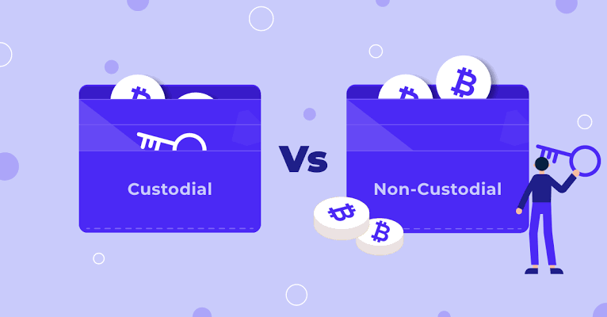

# Wallet
## Your digital identity 
---
## Understanding Cryptocurrency Wallets

A cryptocurrency wallet is a tool that securely stores your private keys, enabling you to manage and access your digital assets.

### Key Features of Wallets
- **Store Private Keys**: Wallets store private keys, which are necessary to authorize transactions, and public addresses, which are used to receive funds.
- **Variety of Wallet Types**: hardware, software, and paper wallets
- **Support for Multiple Cryptocurrencies**: manage multiple cryptocurrencies in one place.

---
### Wallet Types

---

# Custodial vs Non-Custodial Wallets

|                     | **Custodial**              | **Non-Custodial**              |
|---------------------|----------------------------|---------------------------------|
| **Known as**        | Trading Account            | Private Key Wallet              |
| **Control**         | Third-party holds keys     | You hold your keys              |
| **Philosophy**      | "Crypto made easy"         | "Your keys, your crypto"        |
| **Web3 Access**     | No DeFi/dApps              | Full DeFi/dApps access          |
| **Risk**            | Hack/company failure       | Lost/stolen keys                |
| **Experience**      | Easy, familiar             | Learning curve                  |
| **Privacy**         | Requires KYC/AML           | No ID required                  |
| **Tradeoff**        | Convenience, less control  | Control, more responsibility    |

---

# Software Wallets

Software wallets are applications or programs that can be installed on your computer or mobile device. They are convenient and accessible but may be vulnerable to malware or hacking.

### Key Insights from Vitalik Buterin
Vitalik Buterin, the co-founder of Ethereum, emphasizes the importance of understanding the trade-offs between convenience and security when using software wallets. He advises users to:
- Regularly update wallet software to patch vulnerabilities.
- Use wallets with strong encryption and backup features.
- Consider multi-signature wallets for added security.

---
# Examples of Software Wallets

- **Metamask**: A browser extension and mobile wallet that supports Ethereum and ERC-20 tokens, with dApp integration.
- **Phantom**: A user-friendly wallet primarily for Solana blockchain, offering staking and NFT support.
- **Rainbow**: An Ethereum wallet with a beautiful interface, focused on DeFi and NFT management.
- **X-Wallet**: A multi-chain wallet created by myself, supporting various networks and featuring simple staking and swapping features.
---

# Hardware Wallets

Hardware wallets are physical devices designed to securely store your private keys offline, providing a high level of security against online threats.

### Examples of Hardware Wallets
- **Ledger Nano S/X**: Popular hardware wallets supporting a wide range of cryptocurrencies.(7M $ makerDAO)
- **Trezor**: Known for its user-friendly interface and robust security features.
- **KeepKey**: Offers a sleek design and integration with various -  software wallets.
- **HSM Wallet**: Server Oriented Blockchain Protection

<!-- ### Key Insights from Vitalik Buterin
Vitalik Buterin highlights the importance of using hardware wallets for long-term storage of significant cryptocurrency holdings. He recommends:
- Keeping hardware wallets in a secure physical location.
- Using a strong PIN and enabling passphrase protection for added security.
- Regularly verifying the firmware of your hardware wallet to ensure it is up to date.
- Avoiding the purchase of hardware wallets from unofficial or untrusted sources to prevent tampering. -->
---
# Paper Wallets
Paper wallets store your cryptocurrency keys offline by printing them on paper.

- **Pros:** Immune to online attacks, no special hardware needed.
- **Cons:** Vulnerable to physical damage or loss; if lost, funds are unrecoverable.

> **Tip:** Always generate paper wallets offline and keep multiple secure copies.
<!-- 
### Best Practices for Paper Wallets
- Use a trusted wallet generator in an offline environment.
- Print multiple copies and store them in secure, separate locations.
- Consider laminating the paper to protect it from wear and tear.
- Avoid sharing or exposing the private key to anyone.
- Test the wallet with a small amount of cryptocurrency before transferring larger amounts. -->

---
# Crypto Wallet Security

## Best Practices for Wallet Security
### General Security Tips
- **Enable 2FA**: Add an extra security layer to your wallet.
- **Use Strong Passwords**: Create unique, complex passwords.
- **Avoid Phishing**: Verify websites before entering information.

### Backup and Recovery
- **Regular Backups**: Store wallet backups securely.
- **Protect Recovery Phrases**: Keep recovery phrases offline in safe locations.
---

### Device Security
- **Keep Software Updated**: Regularly update your wallet software and device operating system to protect against vulnerabilities.
- **Use Antivirus Software**: Install and maintain reputable antivirus software to safeguard your devices.

### Avoid Public Wi-Fi
- **Use Secure Networks**: Avoid accessing your wallet on public Wi-Fi networks. Use a VPN for added security when necessary.

### Multi-Signature Wallets
- **Enable Multi-Signature**: Use wallets that support multi-signature functionality to require multiple approvals for transactions, enhancing security.

### Physical Security
- **Protect Hardware Wallets**: Store hardware wallets in a secure physical location and avoid sharing them with others.
- **Secure Paper Wallets**: Keep paper wallets in waterproof and fireproof containers to prevent damage.

By following these best practices, you can significantly reduce the risk of losing your digital assets and ensure the safety of your cryptocurrency holdings.
---
# Cryptocurrency Exchanges
## Understanding Cryptocurrency Exchanges

Cryptocurrency exchanges are platforms that facilitate the buying, selling, and trading of cryptocurrencies. They act as intermediaries, connecting buyers and sellers while providing tools for managing digital assets.

### Types of Exchanges
- **Centralized Exchanges (CEXs)**: Operated by companies that manage the platform and hold users' funds. Examples include Binance, Coinbase, and Kraken.
- **Decentralized Exchanges (DEXs)**: Peer-to-peer platforms that allow users to trade directly without intermediaries. Examples include Uniswap, PancakeSwap, and SushiSwap.

### Key Features of Exchanges
- **Liquidity**: Centralized exchanges often provide higher liquidity, enabling faster trades and better price stability.
- **Security**: Decentralized exchanges offer enhanced security by allowing users to retain control of their private keys.
- **Trading Pairs**: Exchanges support various trading pairs, enabling users to trade between different cryptocurrencies or fiat currencies.

### Best Practices for Using Exchanges
- **Verify Exchange Reputation**: Research the exchange's history, security measures, and user reviews before using it.
- **Enable Security Features**: Use two-factor authentication (2FA) and withdrawal whitelists to enhance account security.
- **Avoid Storing Funds on Exchanges**: Transfer your funds to a secure wallet after completing trades to minimize the risk of loss due to hacking.

By understanding the differences between centralized and decentralized exchanges and following best practices, you can make informed decisions when trading cryptocurrencies.

---

# End